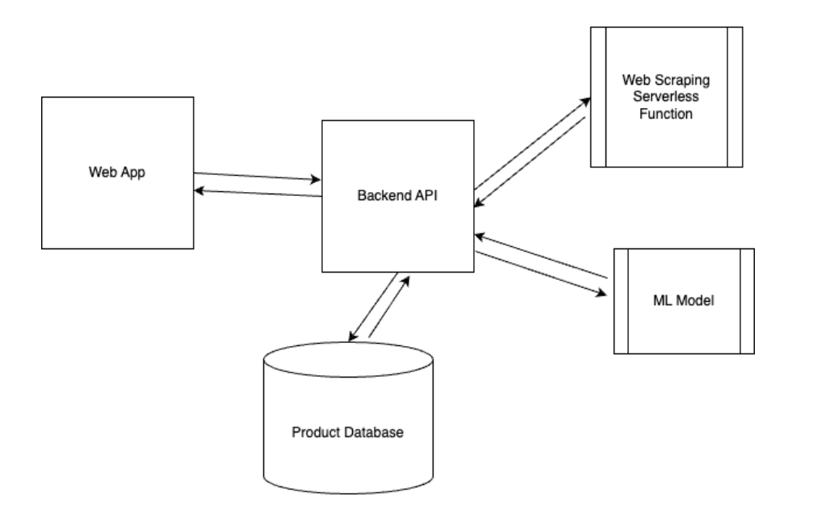
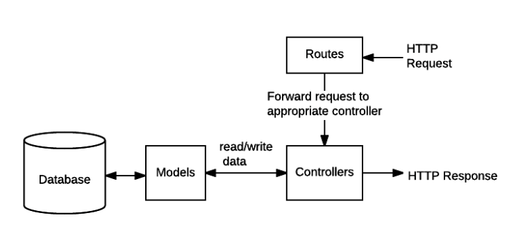

# API
> TrustSubmarine is an Amazon product review verification and authenticity verifier.

This repo is the API for the project, which interacts with the Web Scraper and Model services hosted on AWS Lambda and Fly.io

### Project Architecure

### API Endpoints

The following endpoints are a part of the API:
| Supported Requests | Route | Details |
| :--- | :--- | :--- |
| GET | /\<website-name\>/\<encodedURI\> | Get all product info if is_calc=true, else trigger the scraper and model and then get info |
| PUT | /\<website-name\>/\<encodedURI\> | Triggers recomputation of a memoised score |

